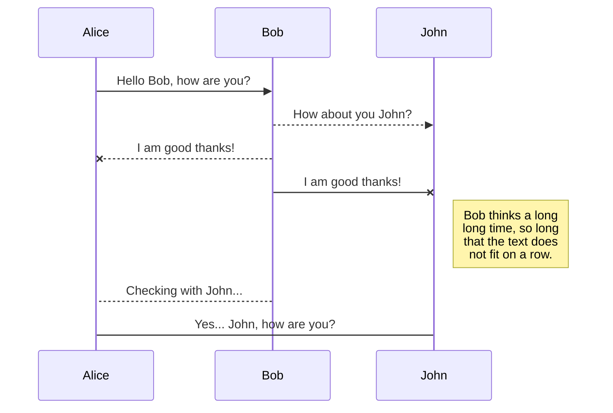
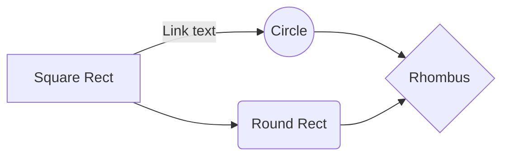

# Get start with TVM-1
# 2021.7.7
## model without tuning
跟着这里的教程跑了一遍：https://github.com/leoluopy/autotvm_tutorial

在运行代码的时候，突然报错：
CUDA initialization: CUDA unknown error - this may be due to an incorrectly set up environment, e.g. changing env variable CUDA_VISIBLE_DEVICES after program start. Setting the available devices to be zero. 
解决办法
- export CUDA_VISIBLE_DEVICES = 0 (无效)
- 重装torch,reboot(OK) 

没有对pytorch模型进行转换，因为TVM支持直接编译pytorch模型，结果：

(1):单张图片在GPU的推理时间：33.50ms

(2):600张图片在GPU的平均推理时间：12.60ms

(3):TVM编译pytorch模型之后，推理测试600张的图片的平均时间：14.99ms (std: 0.47ms)

可以发现，这个时候没有对模型进行优化，推理时间是比原始的pytorch模型是更久的。

## autoTVM
使用TVM自带的自动调优的包来进行优化，关键函数：autotvm.apply_history_best(log_file)。.log包括一些优化的配置，但是还没看明白做了哪些优化。
然后进行重新编译，依然使用PassContext()的三级优化来编译，TVM编译调优的pytorch模型后，推理测试600张的图片的平均时间：6.16ms (std: 0.30 ms)

|method| mean time() |
|--|--|
|  |  |

优化VS不优化：Gain = 14.99ms - 6.16ms = 8.83ms

优化VS pytorch: Gain = 12.60ms - 6.16ms = 5.94ms

## 小结
- 基本解决了上一周的两个疑惑，直接使用一张图片来测试推理时间，前后会有一些波动，单张33.5ms vs 平均12.60ms
- 两次的实验MobileNetv2、CenterFace(上周GitHub的blog也说明了这个问题)验证了不经过优化的模型直接用TVM编译并没有加速的效果，反而时间变长了，因此在后期的模型优化过程，需要自动调优或者手动调优才能实现加速。

# 2021.7.8
## TVM int8 quantize
模型：
接口：mod  =  relay.quantize.quantize(mod, params)
最新的0.8版本官方文档没有找到这个接口......但是依然可以用......

## SmartyPants

SmartyPants converts ASCII punctuation characters into "smart" typographic punctuation HTML entities. For example:

|                |ASCII                          |HTML                         |
|----------------|-------------------------------|-----------------------------|
|Single backticks|`'Isn't this fun?'`            |'Isn't this fun?'            |
|Quotes          |`"Isn't this fun?"`            |"Isn't this fun?"            |
|Dashes          |`-- is en-dash, --- is em-dash`|-- is en-dash, --- is em-dash|

## KaTeX

You can render LaTeX mathematical expressions using [KaTeX](https://khan.github.io/KaTeX/):

The *Gamma function* satisfying $\Gamma(n) = (n-1)!\quad\forall n\in\mathbb N$ is via the Euler integral

$$
\Gamma(z) = \int_0^\infty t^{z-1}e^{-t}dt\,.
$$

torial-and-quick-reference).

## UML diagrams

You can render UML diagrams using [Mermaid](https://mermaidjs.github.io/). For example, this will produce a sequence diagram:

And this will produce a flow chart:

<!--stackedit_data:
eyJoaXN0b3J5IjpbOTI0NDU0NDIzLC0zMzM5MDY4MjcsLTI3NT
YyNzQ0OSw5NjEzMjYxMjFdfQ==
-->